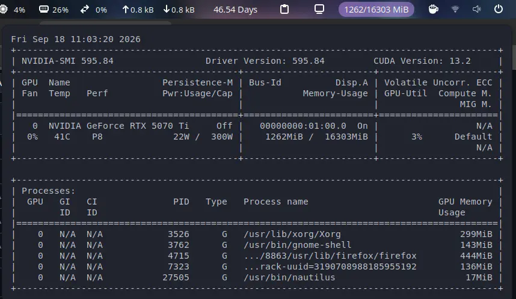

# NVIDIA SMI Indicator

A GNOME Shell extension that shows your GPU's VRAM usage in the top bar and
opens a GPU dashboard when clicked.

**Top bar:** a GPU icon and the VRAM figure, shown as a percentage by default
(or as `GiB` / `MiB`, see Settings). The value turns yellow at 80 % and red at
90 % VRAM usage so memory pressure is visible at a glance.

**Dropdown:**

- one row per GPU with name, VRAM used/total, a usage bar, GPU utilisation,
  temperature and power draw;
- the processes using the GPU, sorted by memory;
- the raw `nvidia-smi` output, collapsed under *Raw nvidia-smi output*;
- *Copy nvidia-smi Output* and *Settings…* actions.

Requires the NVIDIA proprietary driver with `nvidia-smi` on `PATH`. If it's
missing or fails, the indicator shows `N/A` and the dropdown explains why.



## Installation

```sh
git clone https://github.com/Nyndow/nvidia-smi-extension.git
ln -s "$(pwd)/nvidia-smi-extension/nvidia-smi@nyndow.github.io" \
      ~/.local/share/gnome-shell/extensions/nvidia-smi@nyndow.github.io
glib-compile-schemas nvidia-smi-extension/nvidia-smi@nyndow.github.io/schemas
gnome-extensions enable nvidia-smi@nyndow.github.io
```

Reload GNOME Shell first if it doesn't show up: `Alt+F2` → `r` → `Enter`
(X11), or log out/in (Wayland).

Tested on GNOME Shell 46.

## Settings

Open them from the dropdown (*Settings…*) or with
`gnome-extensions prefs nvidia-smi@nyndow.github.io`:

| Setting            | Default | What it does                                              |
|--------------------|---------|-----------------------------------------------------------|
| Show VRAM as       | Percent | Top-bar format: `8%`, `1.2/15.9 GiB` or `1262/16303 MiB` |
| Show GPU icon      | On      | Toggle the icon next to the value                         |
| Warning threshold  | 80 %    | VRAM usage at which the value turns yellow (0 disables)   |
| Critical threshold | 90 %    | VRAM usage at which the value turns red (0 disables)      |
| Refresh interval   | 2 s     | Seconds between `nvidia-smi` queries                      |

## How it works

See [CONTRIBUTING.md](CONTRIBUTING.md) for the internals.

## License

[GPL-2.0-or-later](LICENSE)
